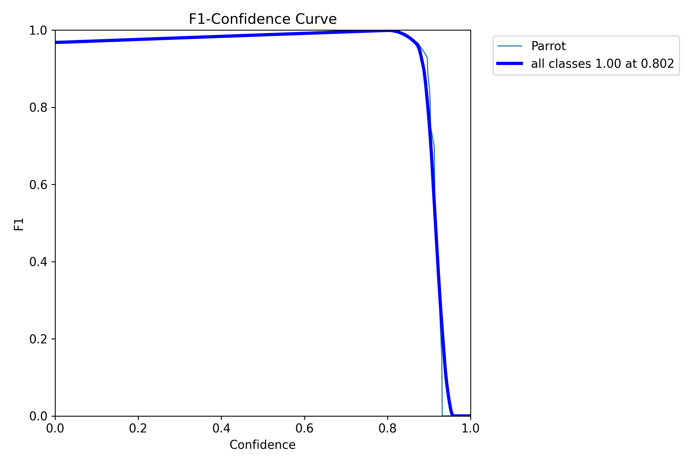
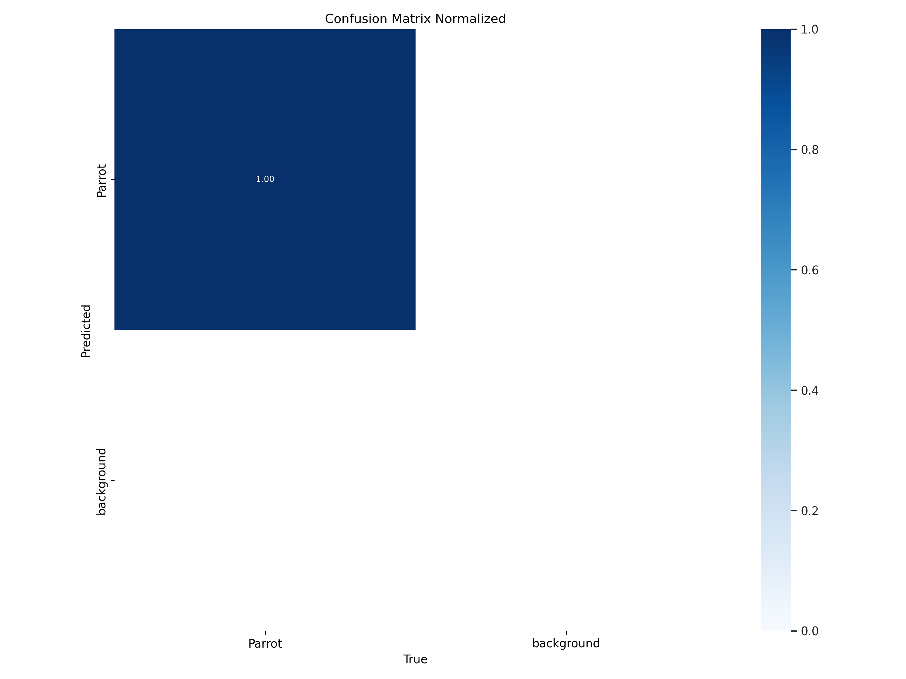
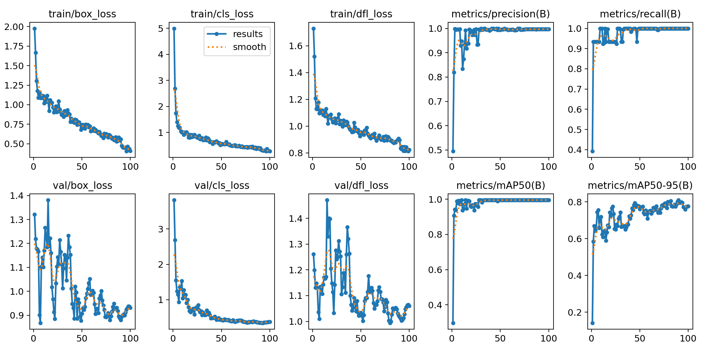
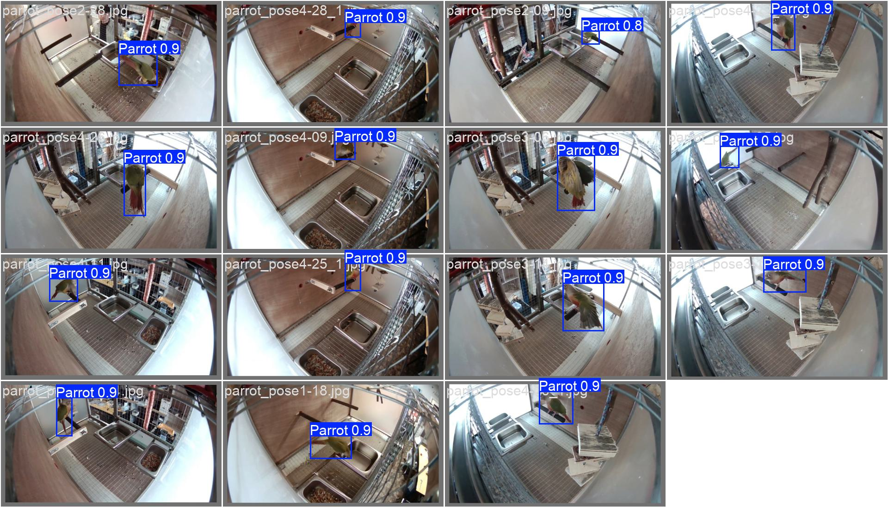
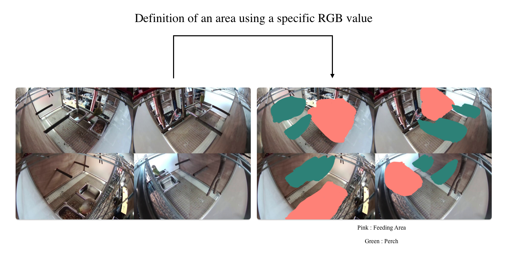

# Parrot_Detection_with_YOLO
### Abstract

The market for pet birds in the United States is continuously growing, which in turn is driving an explosive demand for various pet devices and solutions. Meanwhile, South Korea is also witnessing a surge in interest in pet birds, reflecting this global trend, and the need for technologies to enhance bird health and welfare is being increasingly emphasized. In particular, intelligent and sensitive animals like parrots are highly susceptible to stress, making it crucial to detect and manage their stress levels at an early stage.

Against this backdrop, research has been conducted to apply object detection technology to track the real-time location of parrots within their cages. This approach could later enable the precise monitoring of the parrot's behavioral patterns and positional changes, allowing for early recognition and intervention when stress occurs. Additionally, this research could serve as a stepping stone towards the development of smart birdcages.

---
### Training
Data : We used LabelImg to manually annotate the bounding boxes of the parrots, utilizing approximately 150 images.

Model: YOLOv5su (optimized for embedding on small devices)

---
### Training Results

As shown in the image below, the F1 Score demonstrates excellent performance, reaching a perfect score of 1 at a confidence level of 0.802, with the Confusion Matrix reinforcing this trend. Furthermore, the final image indicates that the loss has sufficiently converged, and that mAP50, Precision, and Recall all exhibit very high performance.
<table>
  <tr>
    <td></td>
    <td></td>
  </tr>
</table>
<table>
  <tr>
    <td></td>
    <td></td>
  </tr>
</table>

---

### After Object Detection
We aimed to define a region at a specific pixel location using a particular RGB value and to apply this as the lower boundary of the object detection bounding box.
<table>
  <tr>
    <td></td>
  </tr>
</table>

---
### Final
